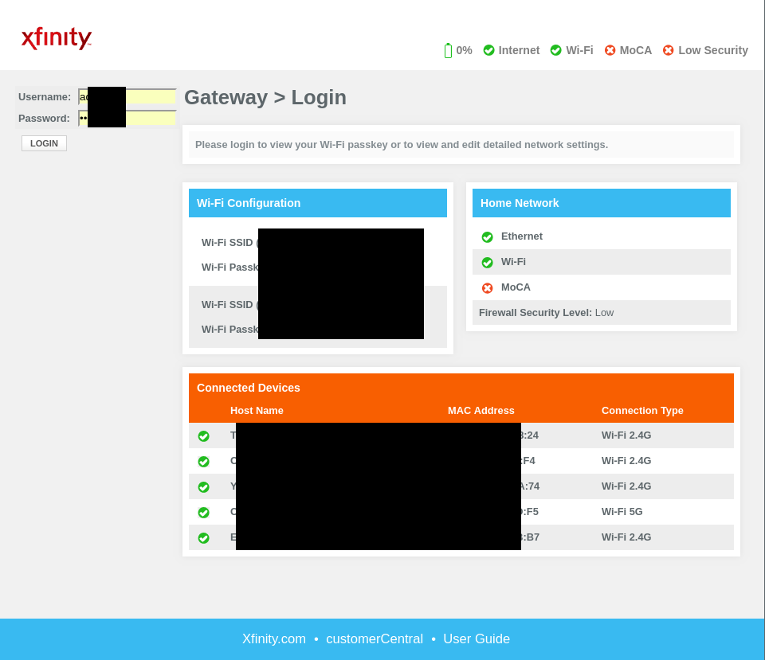

# Query an Xfinity Gateway

This library allows an Xfinity Gateway to be queried for connected devices. It uses the `requests` library to scrape the web interface of the gateway.

## Usage
```python
from xfinity_gateway import XfinityGateway

# Connect to gateway
gateway = XfinityGateway('10.0.0.1')

# Get list of all connected devices' MAC addresses
gateway.scan_devices()

# Get specific device's name
gateway.get_device_name('mac address of device here')
```

## Thoughts

I have only tested on my own Xfinity-provided gateway:
| | |
| --- | --- |
| Model: | TG1682G |
| Hardware Revision: | 9.0 |

If your gateway's web interface looks like the following, this library will likely work:


Please open a Github issue if you encounter any problems. Thanks!